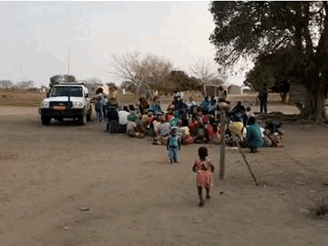
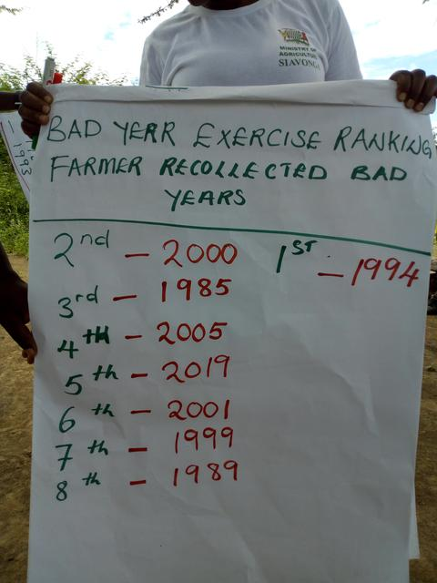
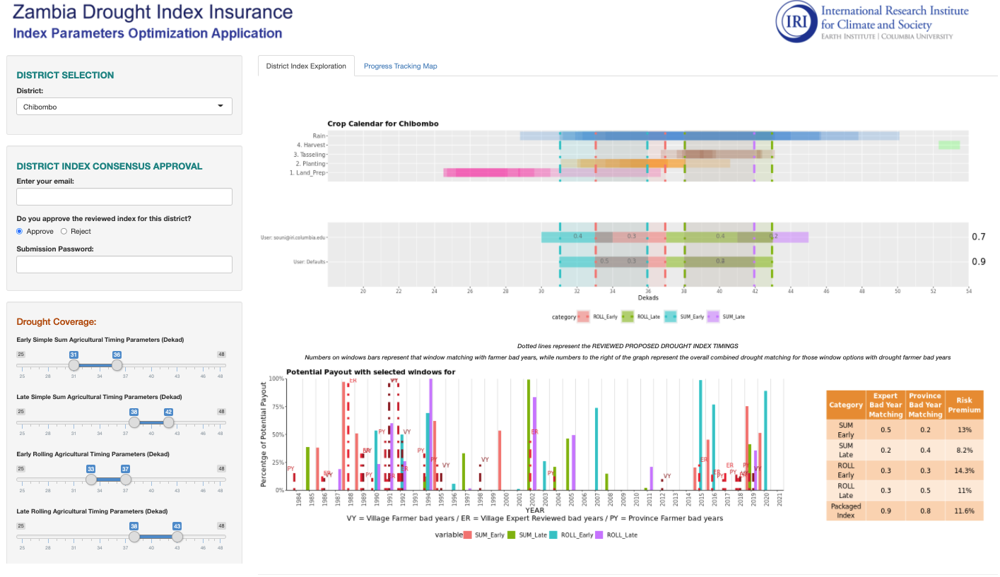

# ESA Living Planet Symposium 2022, May 23-27
Taking the pulse of our planet from space

## Space for climate and disaster risk finance 
### a partnership between ESA and the World Bank on Financial Resilience

## Problem

* Climate change is overwhelming our ability to address disasters
	+ Need to finance preparedness, response, recovery at unprecedented scales

* We have data, we have demands, but how do we build solutions?
	+ Massive satellite datasets, millions of people have demands but we are ineffective at connecting the two.

* Analysis not enough
	+ Our top down models harness traditional or machine learning techniques to prescribe ineffective solutions that are not driven by the perspective from the ground.

	+ Example: If the rainfall starts late, a farmer might lose their crop or might be able to replant.  Totally different financing is needed depending on the farmer.  The satellite, analysis and machine learning do not know what the farmers can and cannot do.  Only the farmers know that.
  
* Design without meaningful input from people solutions are intended for is not only error prone, but sidesteps climate justice principals

## Design grammar for solution

* What we have is a failure to communicate

* Design experts need to work with satellites and millions of farmers in a concrete two way crowd "human in the loop" design process

* Design grammar: 
	+ "Language" to translate the information from farmers and satellites into a step by step collaborative solution design process

## Use case example: Index insurance
Relatively new insurance being implemented at large scales across the developing world to provide nations, farmers, and others with money needed when natural disasters hit.

* Payouts triggered by satellite information

* Easy to get wrong, Important to get right
	+ We need to fix the problem of disasters happening but the satellite formula not providing a payout

##  [World Bank Group's Next Generation Drought Insurance project](https://iri.columbia.edu/news/improving-risk-indicators-introducing-the-next-generation-drought-index-project/) 

### Established to address this disconnect

The design grammar of a practical process for local experts to develop solutions by combining crowdsourced farmer input, satellite data, humanitarian databases, and advanced analysis: 
* Materials: https://fist.iri.columbia.edu/publications/docs/ngdisentraining/ 
* Tool (username WB and password IRI): https://fist-shiny.iri.columbia.edu/WB_Senegal/optimization_app/ 

## Zambia example

An example of effective design grammar used by the Government of Zambia, working with partners such as the [World Food Program R4](https://www.wfp.org/r4-rural-resilience-initiative)

### Farmer Crowdsourcing 
Harnessing the revolution in communications technologies, the government of Zambia with technical support from IRI and WFP has had focus group meetings in more than every seventh village in the country this year, asking farmers what they need in insurance--and having the answers populate a live design database.  
 
Additional types of crowdsourcing include games that farmers play on their phones, described at this link: [ikon](https://iri.columbia.edu/news/crowdsourcing-insurance/)

https://fist-cleandat.iri.columbia.edu/viewrec2

<video width="900" height="240"  controls>
  <source src="MassiveZambiaCrowdsource.mp4" type="video/mp4">
</video>

### Cleaning farmer data

Farmer recollections are not perfect.  To use them to fix index insurance experts must clean the data, similar to the cleaning process in a clinical study.  Zambian experts compared answers and discussion across villages in a district, review the notes of the village meetings, and follow up on concerns, reconciling the villages in a district into a district level summary.

 
Clicking on the link below shows the tool reflecting the grammar for Zambian experts to perform this cleaning process working with the language provided by the farmers
 

https://fist-cleandat.iri.columbia.edu/comzambia
 

 
Its possible to drill down to a village and see the details of each discussion.  This information, along with historical yields allows local experts to determine standards for what needs insurance should address. Thanks to Zachary Huang and others at The  Columbia University's Data Science Institute for making this possible. 
These will be reconciled with yield data and satellites in later steps

### Grammar translating farmer needs and satellite data into insurance formulas 
The solution uses input from the farmers that can directly be used in designing better indexes: What years were the most challenging? And what times during the year they are most at risk?  Government experts check if historical satellite datasets during the risky times of year reflect the bad years farmers reported to find improvements.  These are cross checked against the historical yield data, and the documented crop agronomics.  This process provides the information that the farmers themselves can directly review and approve, refuse, or improve in the next round of crowdsourcing. 
 
If the agreement is low, there are problems that need to be solved for the insurance to be responsible.  If agreement is high, it is worth moving forward. 
 
The link below connects to the tool that Zambian experts are using to understand the potential for improving index insurance

User: BETTERINDEXES, Password: IRI
 
https://fist-shiny.iri.columbia.edu/shiny_apps/Apps/Zambia_Window_consolidation_app/
 

You can select nearly  any district in Zambia and then drag the timing blue bars for different satellites/algorithms to see what the agreement is between the satellites, farmers recollections, and the government yield datasets.  The defaults are from the risky times reported by farmers.
 
For the real project, the next step is to send the analysis to the insurance companies as a specification/standard for what an insurance product should do. 

### Additional Acknowledgments 

These tools that local experts use farmer input to fix index insurance using the latest datascience and remotesensing are prototypes. We would like to acknowledge transformational resources from  [ACToday](https://iri.columbia.edu/news/2021-actoday-highlight-helping-provide-insurance-to-a-million-smallholder-farmers/),  seed funding from the [Columbia University Data Science Institute](https://datascience.columbia.edu/), [CCAFS](https://ccafs.cgiar.org/) and [Earth Institute, now known as the Climate School](https://www.climate.columbia.edu/) helped make new projects like the [NSF funded DESDR](https://www.nsf.gov/awardsearch/showAward?AWD_ID=2103794&HistoricalAwards=false) possible to formalize the grammar and strengthen  prototypes into software frameworks strong enough to be configured and applied in a range of contexts.  

Additonal information at https://fist.iri.columbia.edu/publications/docs/Forecasts4Action/
https://fist.iri.columbia.edu/publications/docs/BetterIndexesZambia/ and 
 [State of the Planet Blog](https://iri.columbia.edu/news/in-new-project-millions-of-farmers-will-help-to-improve-insurance-against-climate-disasters) 

